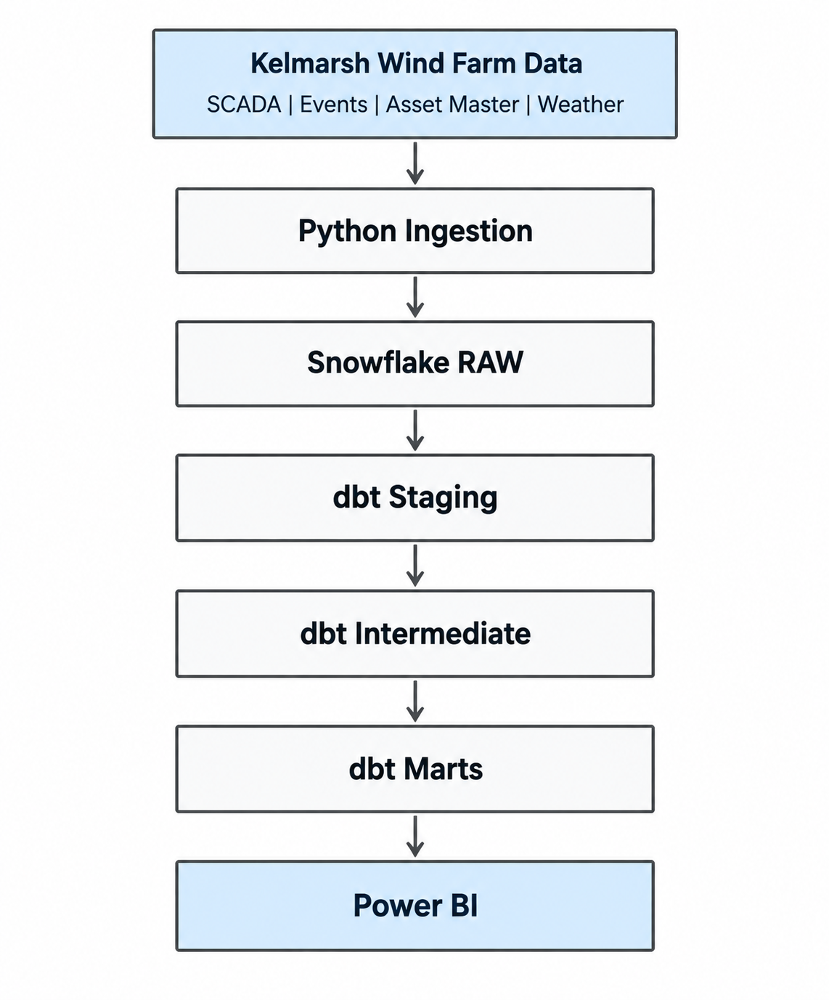
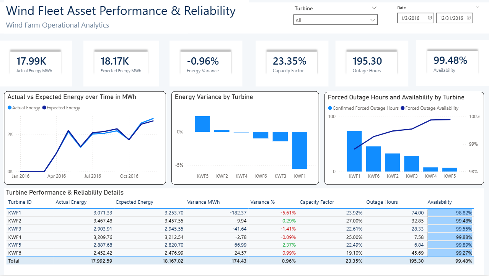

# Wind Asset Analytics Platform

An end to end analytics project for monitoring wind turbine performance and reliability using real Kelmarsh Wind Farm operational data.

## What I Built

I built a data pipeline that transforms raw turbine data into business ready performance and reliability reporting.

**Pipeline**

Kelmarsh Wind Farm Data  
→ Python Ingestion  
→ Snowflake RAW  
→ dbt Staging  
→ dbt Intermediate  
→ dbt Marts  
→ Power BI



## Tech Stack

- Python
- SQL
- Snowflake
- dbt
- Power BI
- GitHub

## Data

The project uses data for six wind turbines including:

- SCADA measurements
- turbine events and outages
- asset information
- weather data

The SCADA dataset contains more than **314K turbine measurements**.

## Dashboard

The Power BI dashboard provides a single view of fleet performance and reliability.



Key KPIs include:

- Actual Energy: **17.99 GWh**
- Expected Energy: **18.17 GWh**
- Energy Variance: **-0.96%**
- Capacity Factor: **23.35%**
- Confirmed Forced Outage Hours: **195.30**
- Forced Outage Availability: **99.48%**

## Key Findings

- Fleet production was around **0.96% below the expected benchmark**.
- KWF1 had the largest negative energy variance.
- KWF5 showed the strongest positive variance.
- The fleet recorded **195.3 confirmed forced outage hours** during the analysed commercial period.
- Confirmed forced outage availability remained approximately **99.5%**.

## Repository

```text
ingestion/   Python data ingestion
dbt/         Data transformation and tests
powerbi/     Power BI dashboard
docs/        Architecture and dashboard images
```

## Future Improvement

Pipeline orchestration with Apache Airflow can be added as a future enhancement.
